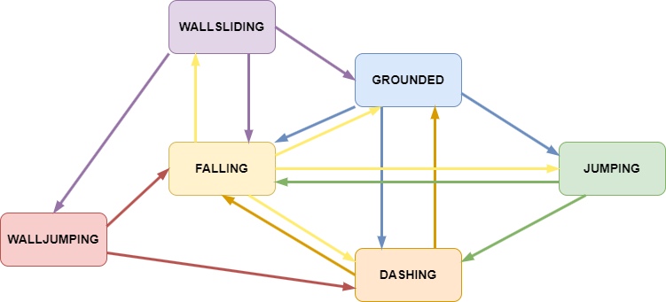

# Character Controller - Platformer 2D

This Unity project offers a handy player controller made for 2D platformer games, based on the YouTube tutorials by [`Dawnsour`](https://www.youtube.com/playlist?list=PLRsowSGWU4GiYNO6kgDMSb7cied6LWDnV). It uses `Rigidbody2D` physics for smooth movement, mainly by applying forces for dynamic motion. It also integrates Unity's `New Input System`.

You can try a demo from this [`itch.io`](https://diegorg64.itch.io/character-controller-platformer-2d) page.

## Table of contents
- [Player States](#player-states)
- [Movement Parameters](#movement-parameters)
    - [Gravity](#gravity)
    - [Run](#run)
    - [Jump](#jump)
    - [Slide](#slide)
    - [Dash](#dash)
    - [Assits](#assits)
- [License](#license)

## Player States
The player movement is managed using a state machine. This state-based approach allows a better control and coordination of movement actions. Each state encapsulate specific logic and transitions between states.

## Movement Parameters
The player's movement is entirely parametrized, allowing for a high degree of customization. All movement behaviours are configured through a scriptable object, so you can design and implement as many uniqye movement styles as needed.

These movement parameters are as follows:

### Gravity
- **GravityStrength**: Force needed for the desired Jump Height and Jump Time To Apex.
- **GravityScale**: Strength of the player's gravity as a multiplier of gravity (value of rigidbody2d.gravityScale)
- **FallGravityMult**: Multiplier to the player's gravityScale when falling
- **MaxFallSpeed**: Maximum fall speed of the player when falling
- **FastFallGravityMult**: Larger multiplier to the player's gravityScale when falling anf downwards input is pressed
- **MaxFastFallSpeed**: Maximum fall speed of the player when falling when performing a faster fall

### Run
- **RunMaxSpeed**: Target speed we want the player to reach
- **RunAcceleration**: The speed at which the player accelerates to max speed, can be set to runMaxSpeed to instant acceleration down to 0 for none at all
- **RunDeceleration**: The speed at which the player deceleration to max speed, can be set to runMaxSpeed to instant deceleration down to 0 for none at all
- **RunAccelAmount**: Actual force (multiplied with speedDiff) applied to the player to accelerate
- **RunDecelAmount**: Actual force (multiplied with speedDiff) applied to the player to decelerate
- **AccelInAirMult**: Multiplier applied to acceleration rate when airborne
- **DecelInAirMult**: Multiplier applied to deceleration rate when airborne

### Jump
- **JumpHeight**: Height of the player's jump
- **jumpTimeToApex**: Time between applying the jump force and reaching the desired jump height
-  **JumpForce**: The actual force applied to the player when jumping
- **AdditionalJumps**
- **JumpCutGravity**: Multiplier to increase gravity if the player releases the jump button while jumping
- **JumpHangGravityMult**: Reduces gravity while close to the apex of the jump
- **JumpHangTimeThreshold**: Speeds (close to 0) where the player will experience extra 'jump hang'. The player's velocity.y is closest to 0 at the jump's apex
- **JumpHangAccelerationMult**: Multiplier applied to acceleration rate during 'jump hang'
- **JumpHangAccelerationMult**: Multiplier applied to acceleration rate during 'jump hang'
- **JumpHangMaxSpeedMult**: Multiplier applied to speed during 'jump hang'
- **WallJumpForce**: Force applied to the player when wall jumping
- **WallJumpRunLerp**: Reduces the effect of player's movement while wall jumping

### Slide
- **SlideSpeed**: Target speed we want the player to reach while sliding
- **SlideAccel**: The speed at which the player accelerates to max speed, can be set to runMaxSpeed to instant acceleration down to 0 for none at all
- **WallSlideReleaseTime**: Time the input must be active to detach from the wall

### Dash
- **DashSpeed**: Speed of the dash
- **DashTime**: Duration of the dash
- **DashRefillTime**: Time to recharge the dash after dashing
- **DashSleepTime**: Time that the timeScale will be set to 0 when a dash is performed

### Assits
- **CoyoteTime**: Margin time to perform a jump while the player is falling
- **JumpInputBufferTime**: Margin time in which the jump input can be processed
- **DashInputBufferTime**: Margin time in which the dash input can be processed

## License
This project is released under the MIT License by Diego Ruiz Gil (2024)